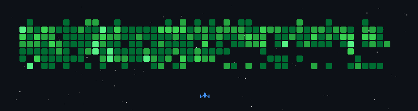

- 👋 Hi, I’m Andy Chen
- 👀 I’m interested in Gaming & Programming 
- 🌱 I’m currently sharpen my skills in Software Architecture 🏗️, Programming Frameworks 📐, and Harness Engineering 🐋
 

- 💻 Welcome to visit my [personal website](https://andyc00.github.io/) with interactive components
- ⭐️ My [React Mini Games](https://andyc00.github.io/React_MiniGames/)
- 🏊🏻‍♀️ An AI reinforced habit recording tool: [Habit Tracker](https://a-habit-tracker.netlify.app/)
- ✒️ A RAG (Retrieval-Augmented Generation) reinforced [AI learning tool](https://manatuapapa.org/)
- 🎮 And a published AI story game I have developed! [link on Steam](https://store.steampowered.com/app/4615410/Everburning_Dark/?beta=0)
 

- 📫 Feel free to reach me on [Linkedin](https://www.linkedin.com/in/jinzhi-chen-a36981172/)
 

 
 

   
  

    
  

  

  

