- 👋 Hi, I’m Andy Chen
- 👀 I’m interested in Gaming & Programming 
- 🌱 I’m currently sharpen my skills in Software Architecture and programming frameworks
- 💻 Welcome to visit my personal website [...](https://andyc00.github.io/)
- ⭐️ My React Mini Games [...](https://andyc00.github.io/React_MiniGames/)
- 🏊🏻‍♀️ A habit recording tool: Habit Tracker [...](https://a-habit-tracker.netlify.app/)
- 🎮 And a published AI game I have developed! [...](https://store.steampowered.com/app/4615410/Everburning_Dark/?beta=0)
- 📫 Feel free to reach me [...](https://www.linkedin.com/in/jinzhi-chen-a36981172/)

 
 

  <picture>
    <source media="(prefers-color-scheme: dark)" srcset="https://raw.githubusercontent.com/AndyC00/AndyC00/output/github-contribution-grid-snake-dark.svg">
    <source media="(prefers-color-scheme: light)" srcset="https://raw.githubusercontent.com/AndyC00/AndyC00/output/github-contribution-grid-snake.svg">
    
  </picture>

  

    
  

